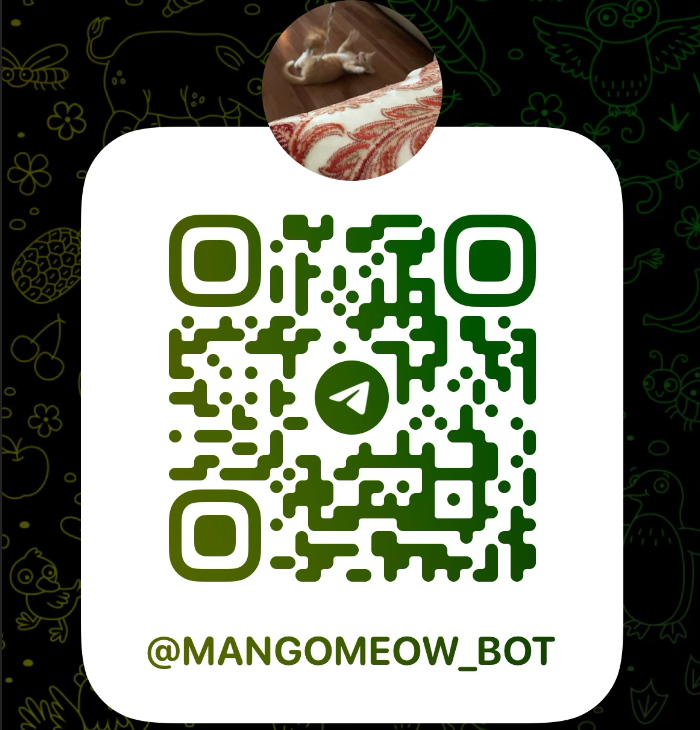
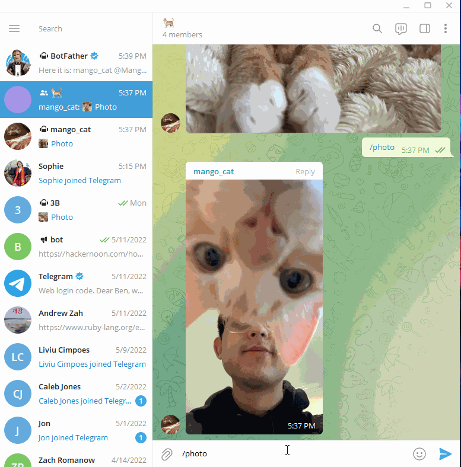

# Mango Meow Bot - A Telegram Cat Photo Bot

## License

  

## Table of Contents
1. [Description](#description)
2. [Installation](#installation)
3. [Demo](#demo)
4. [Technologies](#technologies)
5. [Author](#author) 

## Description
This is a Ruby based bot on telegram that sends a cat photo when you ping the bot with `/photo`! All image files in assets are jpeg currently, but next added functionality will be a conversion of HEIC files to jpeg when photos are called, if they are HEIC. 

## Installation
To install the bot in your group use this QR code!

## Demo

  

## Technologies
 * Ruby
 * Telegram Bot Ruby

 
 
## Author
 Ben Zah: [Github](https://github.com/ZahBenjamin)